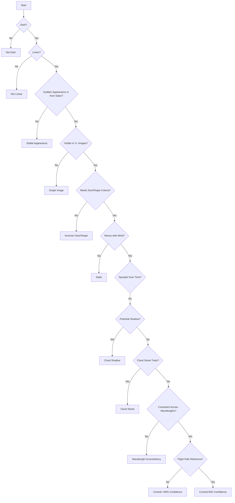

Title:
# GOES16 Contrail Detection with Computer Vision

Description:

Harnessing machine learning and computer vision techniques, this project discerns contrails within GOES-16 satellite data, thereby supplying critical knowledge for climate change studies and global warming countermeasures. It exemplifies the conversion of intricate satellite data into data-driven, impactful environmental solutions.

## process of identifying a contrail:

## Acknowledgements:
##### https://storage.googleapis.com/goes_contrails_dataset/20230419/Contrail_Detection_Dataset_Instruction.pdf
##### https://www.kaggle.com/competitions/google-research-identify-contrails-reduce-global-warming/data
##### high-score-example: https://www.kaggle.com/code/egortrushin/gr-icrgw-training-with-4-folds
##### visualize: https://www.kaggle.com/code/inversion/visualizing-contrails#OpenContrails-dataset-documentation
##### https://eospso.nasa.gov/missions/geostationary-operational-environmental-satellite-16