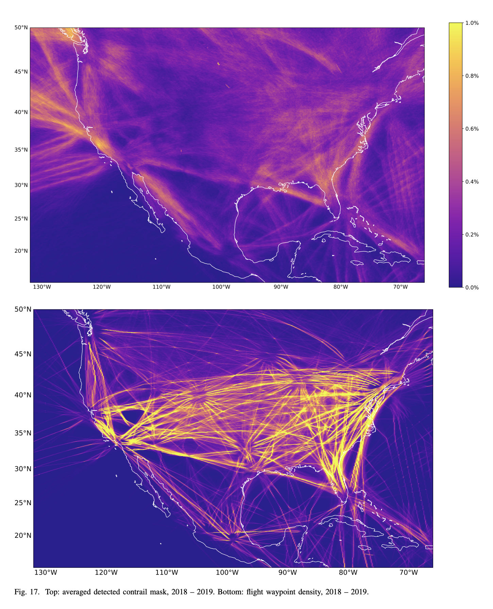

# Contrail Detection using GOES-16 Satellite Imagery and Computer Vision


*Comparison of an image with no contrail (left) and an image with a detected contrail (right)*

#### Abstract:
The paper [OpenContrails: Benchmarking Contrail Detection](https://arxiv.org/abs/2304.02122) presents a new contrail detection model that enhances the study of climate change. The model leverages multiple frames for temporal context to improve detection performance, particularly for young, linear contrails. The model utilizes the OpenContrails dataset, which contains human-labeled contrail detections from the GOES-16 satellite ([labeling-guide](https://storage.googleapis.com/goes_contrails_dataset/20230419/Contrail_Detection_Dataset_Instruction.pdf)).
<br>


> #### Q: Why focus on contrails to curb climate change impacts?
> #### Adam Durant: Non-carbon dioxide sources — like the climate forcing from contrails — make up almost two-thirds of the aviation industry’s impact, which equates to 2% of all human-caused climate change. 



####  •  Dataset: OpenContrails
- Focuses on young, linear-shaped contrails due to their contribution to climate change.
- Contains high-quality per-pixel contrail masks for each image.
- Includes contrail detection model output from multiple years of GOES-16 images.
- Covers the North and South American region with 10-minute interval images since April 2019.
- The contrail detection model uses deep neural networks, including ResNet and DeeplabV3+ architectures.


The dataset and outputs are publicly available on the Google Cloud Storage bucket: [goes_contrails_dataset](https://console.cloud.google.com/storage/browser/goes_contrails_dataset)

---

#### :: Documentation ::

• [Flowchart 📈: comprehensive decision tree for contrail identification](https://gist.github.com/patmejia/dfb7b0ce44accb67dbe58a9524623002)<br>
• [Contrails: Formation, Potential Mix-Ups, and Climatic Impact](https://www.kaggle.com/code/patimejia/contrail-formation-errors-climate-impact) <br>
• [ArXiv OpenContrail in a Visual Nutshell](https://www.kaggle.com/code/patimejia/arxiv-opencontrail-nutshell) <br>
• [Roadmap 📍: Contrail Analysis
](documentation/roadmap_contrail_analysis.md) <br>
  
---
##  ▶︎ Setup

####  • using `conda`
```bash
conda env create -f requirements.yml
conda activate contrail_env
```

####  • using `pip` and `venv`
```bash
python -m venv contrails_env
source contrails_env/bin/activate
pip install -r requirements.txt
```
####  • or, using `conda` and `pip`
```bash
conda create -n contrail_env
conda activate contrail_env
pip install -r requirements.txt
```
##### Both `conda` and `pip` can be used in the same environment, but issues may arise. Using them back-to-back can create an unreproducible state and overwrite packages. To avoid problems, create an isolated conda environment, install most packages with `conda`, and use `pip` with `--upgrade-strategy only-if-needed`.

---
### ⦿ Kaggle api key (optional)
```bash
pip install kaggle
mkdir ~/.kaggle
mv /path/to/kaggle.json ~/.kaggle/kaggle.json
chmod 600 ~/.kaggle/kaggle.json
kaggle competitions list
```
##### ∙ Install the Kaggle CLI <br> ∙ Create a Kaggle account and go to your account settings page. <br> ∙ Click "Create New API Token" to download the `kaggle.json` file  <br> ∙  Move the downloaded file to `~/.kaggle/kaggle.json` <br> ∙ Set permissions for the API key file <br> ∙ Confirm the setup: Run kaggle competitions list to verify the API key works

###  ⦿ Download data (optional)
#####  ∙  sample-dataset ▸ ash-color [22.4k files - 11.74 GB](https://www.kaggle.com/shashwatraman/contrails-images-ash-color)
```bash 
kaggle datasets download shashwatraman/contrails-images-ash-color -p /path/to/desired/directory
unzip contrails-images-ash-color.zip -d /path/to/desired/directory
rm contrails-images-ash-color.zip
```
#####  ∙  full-dataset  ▸  OpenContrails [244.4k files - 450.91 GB](https://arxiv.org/pdf/2304.02122.pdf)

```bash
kaggle competitions download -c google-research-identify-contrails-reduce-global-warming
```
---

## ▶︎ Run
```bash
conda activate contrail_env 
pytest -sv
```

####  ◼︎ Stop
```bash
ctrl + c
```
```bash
conda deactivate
```

####   ⦿ Usage:
```bash
python src/main.py
python run.py samples/false_color_mini_sample/contrails output
python src/utils/rand_record_viz_with_masks_false_color.py --base_dir samples/kaggle_competition_mini_sample/test/1000834164244036115  --n_records 2 --n_times_before 4
python src/utils/get_shape.py samples/kaggle_competition_mini_sample/test/1000834164244036115/band_08.npy
python src/utils/get_shape.py samples/sample_mini/contrails/1108741208571075.npy
python -m src.utils.coordinate_converter samples/kaggle_competition_mini_sample/test/1000834164244036115 output
python src/utils/rle_encoding_submission.py samples/kaggle_competition_mini_sample 2
python src/utils/contrail_animation.py 1000603527582775543
python src/utils/analyze_band_data_and_generate_animation.py 1000216489776414077 train
python src/utils/analyze_band_data_and_generate_animation.py 1000603527582775543 train
python src/utils/analyze_band_data_and_generate_animation.py 1000834164244036115 validation
```
---

##### • Example usage output after running
```bash
python src/main.py
```


### :: Acknowledgements ::

☛ https://arxiv.org/abs/2304.02122: Ng, J. Y.-H., McCloskey, K., Cui, J., Meijer, V., Brand, E., Sarna, A., Goyal, N., Van Arsdale, C., & Geraedts, S. (2023). OpenContrails: Benchmarking Contrail Detection on GOES-16 ABI. arXiv preprint arXiv:2304.02122.
<br>

---
☛ goes_contrails_dataset from OpenContrails: [Benchmarking Contrail Detection on GOES-16 ABI](https://console.cloud.google.com/storage/browser/goes_contrails_dataset)
<br>
☛ Competition: [google-research-identify-contrails-reduce-global-warming](https://www.kaggle.com/competitions/google-research-identify-contrails-reduce-global-warming)
<br>
☛ [k-12: Discover contrails and make one at school](https://www.nasa.gov/sites/default/files/atoms/files/contrails_k-12.pdf)
<br>
☛  [How Contrails Behave: the science of contrails](https://www.globe.gov/web/s-cool/home/observation-and-reporting/contrails/the-science-of-contrails)
<br>

---
☛ visualization: [RAMMB CIRA, colostate.edu](https://rammb-slider.cira.colostate.edu/?sat=goes-18&sec=full_disk&x=12480&y=9274.5&z=0&angle=0&im=12&ts=1&st=0&et=0&speed=130&motion=loop&maps%5Bborders%5D=white&p%5B0%5D=geocolor&opacity%5B0%5D=1&pause=0&slider=-1&hide_controls=0&mouse_draw=0&follow_feature=0&follow_hide=0&s=rammb-slider&draw_color=FFD700&draw_width=6)
<br>
☛ NASA's Eyes On The Earth [Sofware](https://climate.nasa.gov/earth-now/#/), [demo video](https://www.youtube.com/watch?v=p-6DusnZ1pQ)
<br>
☛ rammmb.cira: [Quick Guide: Ash RGB](https://rammb.cira.colostate.edu/training/visit/quick_guides/GOES_Ash_RGB.pdf)
<br>
☛ How to create the standard RGB images: [Compilation of RGB Recipes (i.e. Ash RGB)](https://eumetrain.org/sites/default/files/2020-05/RGB_recipes.pdf)

----
☛ google storage [contrails-labeling-guide](https://storage.googleapis.com/goes_contrails_dataset/20230419/Contrail_Detection_Dataset_Instruction.pdf)
<br>
☛ penn-state-meteo3[Infrared Satellite Imagery](https://www.e-education.psu.edu/meteo3/l5_p5.html)
<br>
☛ penn-state-meteo3 [Interpreting Visible and Infrared Satellite Imagery_Transcript](https://view.officeapps.live.com/op/view.aspx?src=https://www.e-education.psu.edu/meteo3/sites/www.e-education.psu.edu.meteo3/files/transcripts/Interpreting%20Visible%20and%20Infrared%20Satellite%20Imagery_Transcript.docx&wdOrigin=BROWSELINK)
<br>
☛ [Using Python to Explore GOES-16 Data](https://edc.occ-data.org/goes16/python/)

---
☛  google storage [gcp-public-data-goes-16]( https://console.cloud.google.com/storage/browser/gcp-public-data-goes-16;tab=objects?prefix=&forceOnObjectsSortingFiltering=false)<br>
☛ goes-r.gov: [Beginner's Guide to GOES-R Series Data](https://www.goes-r.gov/downloads/resources/documents/Beginners_Guide_to_GOES-R_Series_Data.pdf)
<br>
☛ goes-r.gov: [GOES-R Series Product Definition and users' guide: Level 2+ Algorithm Products, page 43](https://www.goes-r.gov/products/docs/PUG-L2+-vol5.pdf)
<br>
☛ geostationary-operational-environmental-satellite-16 [GOES-16 (Geostationary Operational Environmental Satellite, Launch Date: Nov. 19, 2016)](https://eospso.nasa.gov/missions/geostationary-operational-environmental-satellite-16)
<br>
☛ weather.gov: [GOES-16 Band Reference Guide](https://www.weather.gov/media/crp/GOES_16_Guides_FINALBIS.pdf)

---
☛ Adam Duran - Michigan Tech, Q&A with [SATAVIA: Climate and Contrails](https://www.mtu.edu/unscripted/2021/06/qa-with-satavia-climate-and-contrails.html)
<br>
☛ Catalogues of atmospheric [optics](https://atoptics.co.uk/atoptics/shuttle.htm): [rocket plume, contrail and shuttle plume shadow](https://atoptics.co.uk/atoptics/contr1.htm)
<br>
☛ [STAC](https://stacspec.org/en/tutorials/1-read-stac-python/)
<br>
☛ [WGS84 coordinate system](https://support.virtual-surveyor.com/en/support/solutions/articles/1000261351-what-is-wgs84-) 

----
:: From Kagglers :: <br>
☛ [Inversion - isualize (input dataset 450.91 GB)](https://www.kaggle.com/code/inversion/visualizing-contrails#OpenContrails-dataset-documentation)
<br>
☛ [Shashwatraman -  contrails dataset sample (11.74 GB) train_df.csv, valid_df.csv](https://www.kaggle.com/datasets/shashwatraman/contrails-images-ash-color)
<br>
☛ [egortrushin - high score example]( https://www.kaggle.com/code/egortrushin/gr-icrgw-training-with-4-folds)
<br>
☛ [keegil - Using U-Net to Predict Segmentation Masks in Python & Keras](https://www.kaggle.com/keegil/keras-u-net-starter-lb-0-277)
<br>
☛  [anshuls235 - Time Series Forecasting-EDA, FE & Modelling📈 -  ](https://www.kaggle.com/code/anshuls235/time-series-forecasting-eda-fe-modelling?scriptVersionId=42985144&cellId=7)
<br>
☛  [jamesmcguigan - Reading Parquet Files - RAM/CPU Optimization -  ](https://www.kaggle.com/code/jamesmcguigan/reading-parquet-files-ram-cpu-optimization)

----


<div style="background-color: #1f1f1f; color: #f2f2f2; padding: 10px; border-radius: 5px;">
<h3>Contributing...</h3>
<p style="text-align: left;">👋 Welcome to the contributing section! We're excited to have you join us in enhancing the GOES-16 Satellite Contrail Detection project. Contribute by forking the repository, making changes in a descriptive branch, and submitting a pull request. Join our <a href="https://sdteam6.slack.com/archives/C05D6MBTW2D">Slack</a> channel for real-time communication with other contributors. Follow and contribute to this impactful project to combat climate change through advanced technology 🌍✨</p>
</div>

---

<div style="background-color: #1f1f1f; color: #f2f2f2; padding: 10px; border-radius: 5px;">
  <h3>If you found this repository helpful...</h3>
  <p>
  Please consider giving it a star. Your support helps me continue to develop high-quality code and pursue my career as a data analyst/engineer. Feedback is always welcome and appreciated. Thank you for taking the time to read my work! 
  </p> 
  <h4>
  <p style="text-align: right;">
  <a href="https://github.com/patmejia"> - pat [¬º-°]¬ </a>
  </h4>
  </p>
</div>
