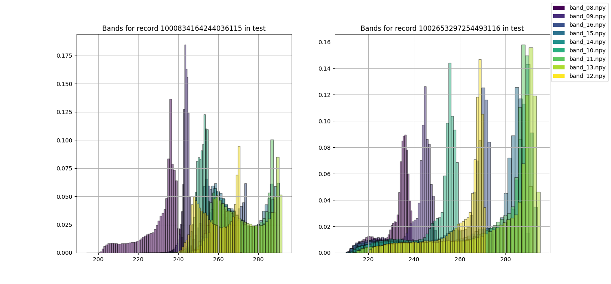

# Climate Analytics: GOES-16 and Aviation Contrails Detection
> **Objective:** Develop a model using satellite and aircraft data to predict contrail formation, number, and duration in specific areas.

---

### GOES-16 Satellite: Earth Monitoring


*GOES-16 provides continuous monitoring from its geostationary orbit 22,300 mi above Earth.*


###### Contrail clouds, originating from aircraft exhaust, play a pivotal role in global warming by modulating Earth's radiation balance [European Geosciences Union, 2019](https://www.sciencedaily.com/releases/2019/06/190627113949.htm). This modulation is quantified by [effective radiative forcing](https://agupubs.onlinelibrary.wiley.com/doi/10.1029/2019JD030581) (ERF), representing the net energy flux alteration at the top of the atmosphere (TOA).

###### $$\Delta N = F - \lambda \Delta T$$ correlating TOA energy imbalance \(\Delta N\) with effective radiative forcing \(F\), climate feedback \(\lambda\), and global temperature shift \(\Delta T\). The magnitude and sign of \(\lambda\) determine the direction of thermal response.

---

###### **Atmospheric column water vapor** is a critical greenhouse determinant, quantifying the vertical water vapor content from Earth's surface to TOA. This metric is represented as the condensed liquid's height/depth uniformly distributed across the column, with units in kg/m^2 or mm.

###### The formula: $$W = \frac{1}{\rho g} \int_{\rho_1}^{\rho_2} x dp$$ defines \(W\) as precipitable water vapor. Here, \(\rho\) is water density, \(g\) is gravitational acceleration, and \(x(p)\) denotes the mixing ratio at a specific pressure \(p\). Its concentration varies with temperature, humidity, and geographical factors. [source: precipitable water vapor](https://glossary.ametsoc.org/wiki/Precipitable_water)

---


## Table of Contents:
1. [Introduction: Climate Analytics and Contrails](#climate-analytics-goes-16-and-aviation-contrails-detection)
2. [Objective](#objective)
3. [GOES-16 Satellite: Earth Monitoring](#goes-16-satellite-earth-monitoring)
4. [Contrail Detection: Climate Change Studies](#contrail-detection-climate-change-studies)
5. [Dataset OpenContrails: Benchmarking on GOES-16 ABI](#dataset-opencontrails-benchmarking-contrail-detection-on-goes-16-abi)
6. [Kaggle Competition: Identify Contrails](#kaggle-competition-identify-contrails-to-reduce-global-warming)
7. [Documentation and Resources](#docs)
8. [Setup](#setup)
9. [Pipeline: Connect to Kaggle Datasets](#pipeline-connect-to-kaggle-datasets)
10. [Run and Usage](#run)
11. [Output Example](#output-example)
12. [Credits](#credit-goes-to-all-authors-and-contributors)
13. [Contributing](#contributing)
14. [License](#license)
15. [Acknowledgments and Support](#acknowledgments-and-support)

---

#### Contrail Detection: Climate Change Studies

[OpenContrails: Benchmarking Contrails Detection](https://arxiv.org/abs/2304.02122) paper underlines contrail's importance, attributing them to $\sim \frac{2}{3}$ of aviation's climate impact and $\sim 2\%$ of all anthropogenic climate changes.


*Right side shows detected contrails (⇥); left side shows absence (⇤).*

#### Dataset OpenContrails: Benchmarking Contrail Detection on GOES-16 ABI
• OpenContrails dataset, collected between April 2019-2020, encompasses:
  - High-resolution contrail masks.
  - Contrail detection model outputs from multiple GOES-16 image years.
  - Emphasis on young, linear-shaped contrails.
  - Utilization of ResNet and DeeplabV3+ architectures for contrail detection.
  - Dataset is publicly available on [Google Cloud Storage](https://console.cloud.google.com/storage/browser/goes_contrails_dataset).

---

#### Kaggle Competition: Identify Contrails to Reduce Global Warming

The [competition](https://www.kaggle.com/competitions/google-research-identify-contrails-reduce-global-warming) aims to develop a model predicting contrail formation and duration. 

The dataset contains 244,400 images, each with 16 spectral bands, from the GOES-16 satellite. The images are labeled with contrail masks, and the goal is to predict the contrail masks for the test set. The competition is sponsored by Google Research and the Laboratory for Aviation and the Environment at MIT. 

Our work will quantifiably improve the confidence in the prediction of contrail-forming regions and the techniques to avoid creating them.


---

#### Docs
• [Flowchart 📈 | Decision tree for contrail identification](https://gist.github.com/patmejia/dfb7b0ce44accb67dbe58a9524623002)
• [Context | Research insights for this study](https://www.kaggle.com/code/patimejia/context-for-goes16-contrails)
• [Pre-print ArXiv | OpenContrails and GOES-16 ABI | Visual Overview](https://www.kaggle.com/code/patimejia/arxiv-opencontrail-nutshell)
• [Roadmap 📍| Contrail Analysis](documentation/roadmap.md)

---


*The overlayed histograms highlight varying pixel distributions across spectral bands, predominantly showcasing lower reflectance values in satellite imagery data.*

---

# Setup
####  • using `conda`
```bash
conda env create -f requirements.yml
conda activate contrail_env
```

####  • using `pip` and `venv`
```bash
python -m venv contrails_env
source contrails_env/bin/activate
pip install -r requirements.txt
```

####  • or, using `conda` and `pip`
```bash
conda create -n contrail_env
conda activate contrail_env
pip install -r requirements.txt
```

##### Both `conda` and `pip` can be used in the same environment, but issues may arise. Using them back-to-back can create an unreproducible state and overwrite packages. To avoid problems, create an isolated conda environment, install most packages with `conda`, and use `pip` with `--upgrade-strategy only-if-needed`.

---

## Pipeline: Connect to Kaggle Datasets

### ⦿ Kaggle api key
#### Visit [Kaggle Settings](https://www.kaggle.com/settings). Under the API section, click on “Create New API Token” to download the `kaggle.json` file.
#### Run the following commands in your terminal:
```bash
pip install kaggle
mkdir ~/.kaggle
mv /path/to/kaggle.json ~/.kaggle/kaggle.json # move .json to kaggle dir (i.e. mv ~ops/Downloads/kaggle.json ~/.kaggle/kaggle.json)
chmod 600 ~/.kaggle/kaggle.json
kaggle competitions list
```

###  ⦿ Download a Kaggle dataset
#####  ∙  sample-dataset ▸ ash-color [22.4k files - 11.74 GB](https://www.kaggle.com/shashwatraman/contrails-images-ash-color)
```bash 
kaggle datasets download shashwatraman/contrails-images-ash-color -p /path/to/desired/directory
unzip contrails-images-ash-color.zip -d /path/to/desired/directory
rm contrails-images-ash-color.zip
```

#####  ∙  full-dataset  ▸  OpenContrails [244.4k files - 450.91 GB](https://www.kaggle.com/competitions/google-research-identify-contrails-reduce-global-warming/data)
```bash
kaggle competitions download -c google-research-identify-contrails-reduce-global-warming
```

---

# Run
```bash
conda activate contrail_env 
pytest -sv
```

####  ◼︎ Stop
```bash
ctrl + c
```
```bash
conda deactivate
```

### Usage
```bash
python src/dataset_to_histogram_reports.py ./samples/kaggle_competition_mini_sample/
#--- 
python src/interactive_globe.py
#---
python -m src.utils.coordinate_converter samples/kaggle_competition_mini_sample/test/1000834164244036115 output
#---
python src/utils/rand_record_viz_with_masks_false_color.py --base_dir samples/kaggle_competition_mini_sample/test/1000834164244036115  --n_records 2 --n_times_before 4
#---
python src/utils/get_shape.py samples/kaggle_competition_mini_sample/test/1000834164244036115/band_08.npy
#---
python src/utils/rle_encoding_submission.py samples/kaggle_competition_mini_sample 2
```

### Output Example
##### `/output/tmp.png`
```bash
python src/main.py
```


---


<h2 id="credit-goes-to-all-authors-and-contributors">🥇 Credit goes to all authors and contributors ⤵︎ </h2>

#### Contrails Research
• 🗞️ news: [preprint: jul 2023 | light Contrail Segmentation via Augmented Transfer Learning with Novel SR Loss Function in Hough Space
Junzi Sun & Esther Roosenbranda, Faculty of Aerospace Engineering, Delft University of Technology](https://arxiv.org/pdf/2307.12032.pdf) • [github @junzi](https://github.com/junzis/contrail-net/tree/main/data)

• [OpenContrails: Benchmarking Contrail Detection on GOES-16 ABI](https://arxiv.org/abs/2304.02122) - Led by MIT Professor Steven Barrett from the Laboratory for Aviation and the Environment. 
• Satellite images are from

 [NOAA GOES-16](https://www.goes-r.gov/).
• [goes_contrails_dataset](https://console.cloud.google.com/storage/browser/goes_contrails_dataset)


#### Visualization Tools
• [RAMMB CIRA](https://rammb-slider.cira.colostate.edu/?sat=goes-18&sec=full_disk&x=12480&y=9274.5&z=0&angle=0&im=12&ts=1&st=0&et=0&speed=130&motion=loop&maps%5Bborders%5D=white&p%5B0%5D=geocolor&opacity%5B0%5D=1&pause=0&slider=-1&hide_controls=0&mouse_draw=0&follow_feature=0&follow_hide=0&s=rammb-slider&draw_color=FFD700&draw_width=6)
• [GOES-16/17](https://www.star.nesdis.noaa.gov/GOES/index.php)
• [NASA's Eyes On The Earth Software](https://climate.nasa.gov/earth-now/#/), [Demo](https://www.youtube.com/watch?v=p-6DusnZ1pQ)
• [Ash RGB Guide](https://rammb.cira.colostate.edu/training/visit/quick_guides/GOES_Ash_RGB.pdf)
• [RGB Recipes](https://eumetrain.org/sites/default/files/2020-05/RGB_recipes.pdf)
• [deck.gl](https://deck.gl/examples/hexagon-layer) 
• [windy.com/aerosol ](https://www.windy.com/-Aerosol?41.706,-88.195,5) 
• [@blaylockbk | goes2go](https://github.com/blaylockbk/goes2go)

#### Educational Resources
• [Discover contrails at school](https://www.nasa.gov/sites/default/files/atoms/files/contrails_k-12.pdf)
• [Science of contrails](https://www.globe.gov/web/s-cool/home/observation-and-reporting/contrails/the-science-of-contrails)
• [Contrails-labeling-guide](https://storage.googleapis.com/goes_contrails_dataset/20230419/Contrail_Detection_Dataset_Instruction.pdf)
• [Infrared Satellite Imagery](https://www.e-education.psu.edu/meteo3/l5_p5.html)
• [Interpreting Satellite Imagery](https://view.officeapps.live.com/op/view.aspx?src=https://www.e-education.psu.edu/meteo3/sites/www.e-education.psu.edu.meteo3/files/transcripts/Interpreting%20Visible%20and%20Infrared%20Satellite%20Imagery_Transcript.docx)
• [Using Python with GOES-16 Data](https://edc.occ-data.org/goes16/python/)
• [Q&A with SATAVIA](https://www.mtu.edu/unscripted/2021/06/qa-with-satavia-climate-and-contrails.html)
• [Atmospheric Optics Catalogues](https://atoptics.co.uk/atoptics/shuttle.htm)
• [STAC](https://stacspec.org/en/tutorials/1-read-stac-python/)
• [WGS84 Coordinate System](https://support.virtual-surveyor.com/en/support/solutions/articles/1000261351-what-is-wgs84-)
• [Moderate Resolution Imaging Spectroradiometer (MODIS)](https://www.earthdata.nasa.gov/learn/find-data/near-real-time/modis)
• [Could air someday power your flight? Airlines are betting on it.](https://portal.staralliance.com/cms/news/hot-topics/2023-01-20/general/could-air-someday-power-your-flight-airlines-are-betting-on-it)
• [Efficacy of climate forcings | Hansen et. al](https://agupubs.onlinelibrary.wiley.com/doi/full/10.1029/2005JD005776)
• [⽕⛆ Pyrocumulonimbus (storm clouds from extreme wildfires)| Identifying the Causes
PyroCb](https://arxiv.org/pdf/2211.08883.pdf)

#### GOES-16 Resources
• [gcp-public-data-goes-16](https://console.cloud.google.com/storage/browser/gcp-public-data-goes-16;tab=objects?prefix=&forceOnObjectsSortingFiltering=false)
• [Beginner's Guide to GOES-R](https://www.goes-r.gov/downloads/resources/documents/Beginners_Guide_to_GOES-R_Series_Data.pdf)
• [GOES-R Series Product Definition](https://www.goes-r.gov/products/docs/PUG-L2+-vol5.pdf)
• [GOES-16](https://eospso.nasa.gov/missions/geostationary-operational-environmental-satellite-16)
• [GOES-16 Band Reference Guide](https://www.weather.gov/media/crp/GOES_16_Guides_FINALBIS.pdf)
• [github: @awslab | noaa-goes16 ](https://github.com/awslabs/open-data-docs/tree/main/docs/noaa/noaa-goes16) 
• [aws/noaa-goes](https://registry.opendata.aws/noaa-goes/)


#### From Kagglers
• [Inversion - isualize (input dataset 450.91 GB)](https://www.kaggle.com/code/inversion/visualizing-contrails#OpenContrails-dataset-documentation)
• [Shashwatraman -  contrails dataset sample (11.74 GB) train_df.csv, valid_df.csv](https://www.kaggle.com/datasets/shashwatraman/contrails-images-ash-color)
• [egortrushin - high score example]( https://www.kaggle.com/code/egortrushin/gr-icrgw-training-with-4-folds)
• [keegil - Using U-Net to Predict Segmentation Masks in Python & Keras](https://www.kaggle.com/keegil/keras-u-net-starter-lb-0-277)
• [anshuls235 - Time Series Forecasting-EDA, FE & Modelling](https://www.kaggle.com/code/anshuls235/time-series-forecasting-eda-fe-modelling?scriptVersionId=42985144&cellId=7)
• [jamesmcguigan - RAM/CPU Optimization | downcasting unit8 → float64](https://www.kaggle.com/code/jamesmcguigan/reading-parquet-files-ram-cpu-optimization)
• [Opencontrails Competition | One month to go! Summary of everything that happened](https://www.kaggle.com/competitions/google-research-identify-contrails-reduce-global-warming/discussion/420629)

---

## Contributing
<div style="background-color:#1f1f1f; color: #f2f2f2; padding: 15px; border-radius: 5px; margin-bottom: 20px;">
    <p>👋 Welcome to the contributing section! We're excited to have you join us in enhancing the GOES-16 Satellite Contrail Detection project. Contribute by forking the repository, making changes in a descriptive branch, and submitting a pull request. Join our <a href="https://sdteam6.slack.com/archives/C05D6MBTW2D">Slack</a> channel for real-time communication with other contributors. Follow and contribute to this impactful project to combat climate change through advanced technology 🌍✨.</p>
</div>

## License
This project is licensed under the terms of the [MIT license](LICENSE).


<div style="background-color: #1f1f1f; color: #f2f2f2; padding: 15px; border-radius: 5px; margin-top: 20px;">
    <p>Work under construction. If there are inaccurate or missing quotes or credits, please email 👷 <a href="mailto:dev@patimejia.com?subject=Inaccurate%20or%20Missing%20Quotes%20or%20Credits">dev@patimejia.com</a>. Thanks!</p>
</div>

---

<div style="background-color: #1f1f1f; color: #f2f2f2; padding: 10px; border-radius: 5px;">
  <h3>If you found this repository helpful...</h3>
  <p>
  If you found this helpful, please consider giving it a star. Your support helps me maintain and continue to develop high-quality code and pursue my career in data analytics. Feedback is always welcome and appreciated. Thank you for taking the time to read this study. I hope you found it insightful and wish you all the best in your data science journey.
  </p> 
  <h4>
  <p style="text-align: right;">
  <a href="https://github.com/patmejia"> - pat [¬º-°]¬ </a>
  </h4>
  </p>
</div>
