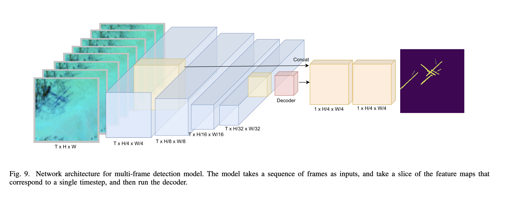

#### Title:
# GOES-16 Satellite Contrail Detection using CV/ML

### Optimizing satellite imagery, [GOES-R ABI](https://www.star.nesdis.noaa.gov/goes/index.php), and advanced computer vision/machine learning for accurate detection of contrails

#### Absract:

##### The "OpenContrails: Benchmarking Contrail Detection" paper proposes a new contrail detection model, enhancing the study of climate change. The model, leveraging multiple frames for temporal context, improves detection performance and focuses on young, linear contrails. It utilizes the OpenContrails dataset, containing human-labeled contrail detections from the GOES-16 satellite, and confirms prior contrail research. The authors present the OpenContrails dataset and model as public benchmarks, promoting advances in contrail research. This work involves contributors from Google's Research Department and MIT's Laboratory for Aviation and the Environment.



> #### Q: Why focus on contrails to curb climate change impacts?
> #### Adam Durant: It’s not just direct engine emissions that matter in terms of aviation’s climate impacts. Non-carbon dioxide sources — like the climate forcing from contrails — make up almost two-thirds of the industry’s impact, which is a surprisingly big number. In fact, it equates to 2% of all human-caused climate change.


#### Dataset: OpenContrails

#### Dataset description:
##### ☛ OpenContrails is a dataset of contrail detections from GOES-16 Advanced Baseline Imager data. <br> ☛ Created to train models for contrail detection and climate impact assessment. <br> ☛ Focuses on young, linear-shaped contrails due to climate change contribution. <br> ☛ Contains high-quality per-pixel contrail masks for each image. <br> ☛ Includes contrail detection model output from multiple years of GOES-16 images. <br> ☛ Images are derived from GOES-16 ABI in geostationary orbit. <br> ☛ Covers North and South American region with 10-minute interval images since April 2019. <br> ☛ Examples generated by random sampling of GOES-16 viewable extent from April 2019-2020. <br> ☛ Samples restricted within -50 to 50-degree latitude and -135 to -30-degree longitude. <br> ☛ Contrail detection model uses deep neural networks, including ResNet and DeeplabV3+ architectures. <br> ☛ Dataset and outputs are publicly available on Google Cloud Storage [bucket: gcp-public-data-goes-16](https://console.cloud.google.com/storage/browser/gcp-public-data-goes-16;tab=objects?prefix=&forceOnObjectsSortingFiltering=false).

## ➲ Setup
```bash
conda create --name contrails_env python=3.8
conda activate contrails_env
pip install -r requirements.txt
```
---
### Kaggle api key (optional)
```bash
pip install kaggle
mkdir ~/.kaggle
mv /path/to/kaggle.json ~/.kaggle/kaggle.json
chmod 600 ~/.kaggle/kaggle.json
kaggle competitions list
```
##### ☛ Install the Kaggle CLI <br> ☛ Create a Kaggle account and go to your account settings page. <br> ☛ Click "Create New API Token" to download the `kaggle.json` file  <br> ☛  Move the downloaded file to `~/.kaggle/kaggle.json` <br> ☛ Set permissions for the API key file <br> ☛ Confirm the setup: Run kaggle competitions list to verify the API key works
---
### Download data (optional)
##### ☛ sample-dataset ▸ ash-color [22.4k files - 11.74 GB](https://www.kaggle.com/shashwatraman/contrails-images-ash-color)
```bash 
kaggle datasets download shashwatraman/contrails-images-ash-color -p /path/to/desired/directory
unzip contrails-images-ash-color.zip -d /path/to/desired/directory
rm contrails-images-ash-color.zip
```
##### ☛ full-dataset  ▸  OpenContrails [244.4k files - 450.91 GB](https://arxiv.org/pdf/2304.02122.pdf)

```bash
kaggle competitions download -c google-research-identify-contrails-reduce-global-warming
```
---

## ➲ Run
```bash
conda activate contrails_env
python src/visualize.py --base_dir samples/sample_mini/contrails --n_records 5 --n_times_before 4
```
#### Stop
```bash
conda deactivate
```
---
### Acknowledgements:

##### 📓 arxiv: https://arxiv.org/abs/2304.02122
##### ☛ gcp-public-data-goes-16: https://console.cloud.google.com/storage/browser/gcp-public-data-goes-16;tab=objects?prefix=&forceOnObjectsSortingFiltering=false
##### 🅺 challenge-guide: https://www.kaggle.com/competitions/google-research-identify-contrails-reduce-global-warming
##### ☛ contrails-labeling-guide: https://storage.googleapis.com/goes_contrails_dataset/20230419/Contrail_Detection_Dataset_Instruction.pdf
##### 🅺 contrails dataset sample (11.74 GB) train_df.csv, valid_df.csv: https://www.kaggle.com/datasets/shashwatraman/contrails-images-ash-color
##### 🅺 visualize (input dataset 450.91 GB): https://www.kaggle.com/code/inversion/visualizing-contrails#OpenContrails-dataset-documentation
##### 🅺 high-score-example: https://www.kaggle.com/code/egortrushin/gr-icrgw-training-with-4-folds
##### 🅺 Using U-Net to Predict Segmentation Masks in Python & Keras: https://www.kaggle.com/keegil/keras-u-net-starter-lb-0-277
##### ☛ Beginner's Guide to GOES-R Series Data: https://www.goes-r.gov/downloads/resources/documents/Beginners_Guide_to_GOES-R_Series_Data.pdf
##### ☛ GOES-R Series Product Definition and users' guide: [Level 2+ Algorithm Products, page 43](https://www.goes-r.gov/products/docs/PUG-L2+-vol5.pdf)
##### ☛ GOES-16 (Geostationary Operational Environmental Satellite, Launch Date: Nov. 19, 2016): https://eospso.nasa.gov/missions/geostationary-operational-environmental-satellite-16
##### ☛ GOES-16 Band Reference Guide: https://www.weather.gov/media/crp/GOES_16_Guides_FINALBIS.pdf
##### ☛ Using Python to Explore GOES-16 Data: https://edc.occ-data.org/goes16/python/
##### ☛ Adam Duran (Michigan Tech, Q&A with SATAVIA: Climate and Contrails): https://www.mtu.edu/unscripted/2021/06/qa-with-satavia-climate-and-contrails.html
##### ☛ catalogues of atmospheric optics (rocket plume, contrail shadow): https://atoptics.co.uk/atoptics/shuttle.htm, https://atoptics.co.uk/atoptics/contr1.htm
##### 📓  U-Net: Convolutional Networks for Biomedical Image Segmentation: https://arxiv.org/abs/1505.04597

```bibtex
@article{ng2023opencontrails,
  title={OpenContrails: Benchmarking Contrail Detection on GOES-16 ABI},
  author={Ng, Joe Yue-Hei and McCloskey, Kevin and Cui, Jian and Meijer, Vincent and Brand, Erica and Sarna, Aaron and Goyal, Nita and Van Arsdale, Christopher and Geraedts, Scott},
  journal={arXiv preprint arXiv:2304.02122},
  year={2023}
}
```