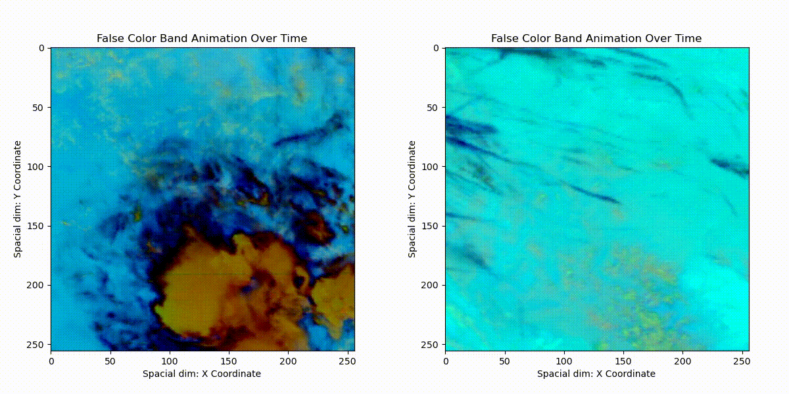
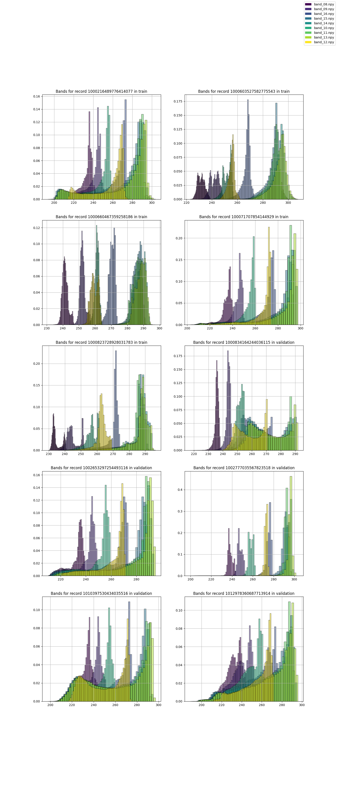
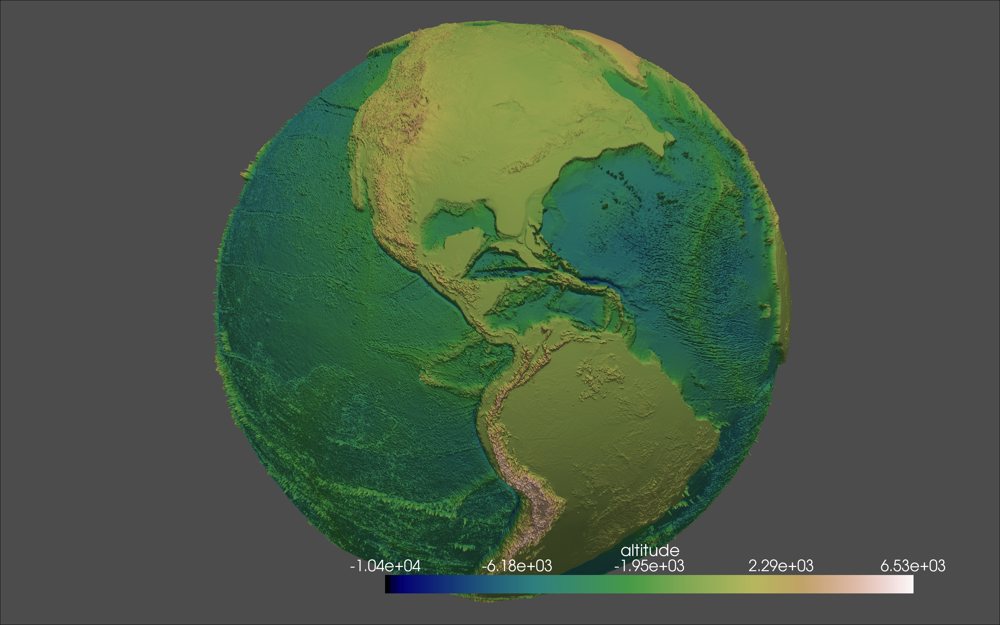

# Climate Analytics: <br>GOES-16 and Aviation Contrails Detection

## Table of Contents:
1. [GOES-16 Satellite: Earth Monitoring](#goes-16-satellite-earth-monitoring)
2. [Contrail Detection: Climate Change Studies](#contrail-detection-climate-change-studies)
3. [Dataset → OpenContrails: Benchmarking Contrail Detection on GOES-16 ABI](#dataset--opencontrails-benchmarking-contrail-detection-on-goes-16-abi)
4. [Identify Contrails to Reduce Global Warming](#identify-contrails-to-reduce-global-warming)
5. [Docs](#docs)
6. [Setup](#⤷-▶︎-setup)
7. [Run](#⤷-▶︎-run)
8. [Usage](#⤷-⦿-usage)
9. [Output Example](#output-example-outputtmppng)
10. [Credit goes to all authors and contributors](#credit-goes-to-all-authors-and-contributors)
11. [Contributing](#contributing)
12. [License](#license)

---
<br>

[OpenContrails: Benchmarking Contrails Detection](https://arxiv.org/abs/2304.02122) paper introduces model, contributes to climate analytics, focuses on contrails. Contrails account for ~2/3 of aviation's climate impact, ~2% of all anthropogenic climate change.

#### :: GOES-16 Satellite: Earth Monitoring ::

*GOES-16, in geostationary orbit 22,300 mi above Earth, matches Earth's rotation, providing continuous full-disk monitoring.*

#### :: Contrail Detection: Climate Change Studies ::

*Contrails detected right (⇥), none left (⇤).*

#### :: Dataset OpenContrails: Benchmarking Contrail Detection on GOES-16 ABI ::
• OpenContrails dataset, collected April 2019-2020, includes:
<br>
• High-resolution per-pixel contrail masks.
<br>
• Contrail detection model output, multiple years of GOES-16 images.
<br>
• Focus on young, linear-shaped contrails.
<br>
• Use of ResNet, DeeplabV3+ architectures in contrail detection model.
<br>
• Dataset, outputs publicly accessible: [Google Cloud Storage](https://console.cloud.google.com/storage/browser/goes_contrails_dataset).

---
#### :: Identify Contrails to Reduce Global Warming ::
• [The Kaggle competition](https://www.kaggle.com/competitions/google-research-identify-contrails-reduce-global-warming) competition underscores contrail study importance in climate change mitigation.

---

#### :: Docs ::
• [Flowchart 📈 | comprehensive decision tree for contrail identification](https://gist.github.com/patmejia/dfb7b0ce44accb67dbe58a9524623002)
• [Context | research for this study](https://www.kaggle.com/code/patimejia/context-for-goes16-contrails)
• [Pre-print ArXiv | OpenContrails and GOES-16 ABI | Visual Booklet](https://www.kaggle.com/code/patimejia/arxiv-opencontrail-nutshell)
• [Roadmap 📍| Contrail Analysis](documentation/roadmap.md)


*The overlayed histograms highlight varying pixel distributions across spectral bands, predominantly showcasing lower reflectance values in satellite imagery data.*

---

# ⤷ ▶︎ Setup
####  • using `conda`
```bash
conda env create -f requirements.yml
conda activate contrail_env
```

####  • using `pip` and `venv`
```bash
python -m venv contrails_env
source contrails_env/bin/activate
pip install -r requirements.txt
```

####  • or, using `conda` and `pip`
```bash
conda create -n contrail_env
conda activate contrail_env
pip install -r requirements.txt
```

##### Both `conda` and `pip` can be used in the same environment, but issues may arise. Using them back-to-back can create an unreproducible state and overwrite packages. To avoid problems, create an isolated conda environment, install most packages with `conda`, and use `pip` with `--upgrade-strategy only-if-needed`.

---

### ⦿ Kaggle api key (optional)
```bash
pip install kaggle
mkdir ~/.kaggle
mv /path/to/kaggle.json ~/.kaggle/kaggle.json
chmod 600 ~/.kaggle/kaggle.json
kaggle competitions list
```

###  ⦿ Download data (optional)
#####  ∙  sample-dataset ▸ ash-color [22.4k files - 11.74 GB](https://www.kaggle.com/shashwatraman/contrails-images-ash-color)
```bash 
kaggle datasets download shashwatraman/contrails-images-ash-color -p /path/to/desired/directory
unzip contrails-images-ash-color.zip -d /path/to/desired/directory
rm contrails-images-ash-color.zip
```

#####  ∙  full-dataset  ▸  OpenContrails [244.4k files - 450.91 GB](https://arxiv.org/pdf/2304.02122.pdf)
```bash
kaggle competitions download -c google-research-identify-contrails-reduce-global-warming
```

---

# ⤷ ▶︎ Run
```bash
conda activate contrail_env 
pytest -sv
```

####  ◼︎ Stop
```bash
ctrl + c
```
```bash
conda deactivate
```

### ⤷ ⦿ Usage:
```bash
python src/dataset_to_histogram_reports.py ./samples/kaggle_competition_mini_sample/
#--- 
python src/interactive_globe.py
#---
python -m src.utils.coordinate_converter samples/kaggle_competition_mini_sample/test/1000834164244036115 output
#---
python src/utils/rand_record_viz_with_masks_false_color.py --base_dir samples/kaggle_competition_mini_sample/test/1000834164244036115  --n_records 2 --n_times_before 4
#---
python src/utils/get_shape.py samples/kaggle_competition_mini_sample/test/1000834164244036115/band_08.npy
#---
python src/utils/rle_encoding_submission.py samples/kaggle_competition_mini_sample 2
```

##### Output Example: `/output/tmp.png`
```bash
python src/main.py
```


---


<h2 id="credit-goes-to-all-authors-and-contributors">🥇 Credit goes to all authors and contributors ⤵︎ </h2>

• [OpenContrails: Benchmarking Contrail Detection on GOES-16 ABI](https://arxiv.org/abs/2304.02122) - Led by MIT Professor Steven Barrett from the Laboratory for Aviation and the Environment. 
• Satellite images are from

 [NOAA GOES-16](https://www.goes-r.gov/).
• [goes_contrails_dataset](https://console.cloud.google.com/storage/browser/goes_contrails_dataset)

#### Visualization Tools
• [RAMMB CIRA](https://rammb-slider.cira.colostate.edu/?sat=goes-18&sec=full_disk&x=12480&y=9274.5&z=0&angle=0&im=12&ts=1&st=0&et=0&speed=130&motion=loop&maps%5Bborders%5D=white&p%5B0%5D=geocolor&opacity%5B0%5D=1&pause=0&slider=-1&hide_controls=0&mouse_draw=0&follow_feature=0&follow_hide=0&s=rammb-slider&draw_color=FFD700&draw_width=6)
• [GOES-16/17](https://www.star.nesdis.noaa.gov/GOES/index.php)
• [NASA's Eyes On The Earth Software](https://climate.nasa.gov/earth-now/#/), [Demo](https://www.youtube.com/watch?v=p-6DusnZ1pQ)
• [Ash RGB Guide](https://rammb.cira.colostate.edu/training/visit/quick_guides/GOES_Ash_RGB.pdf)
• [RGB Recipes](https://eumetrain.org/sites/default/files/2020-05/RGB_recipes.pdf)
• [deck.gl](https://deck.gl/examples/hexagon-layer)

#### Educational Resources
• [Discover contrails at school](https://www.nasa.gov/sites/default/files/atoms/files/contrails_k-12.pdf)
• [Science of contrails](https://www.globe.gov/web/s-cool/home/observation-and-reporting/contrails/the-science-of-contrails)
• [Contrails-labeling-guide](https://storage.googleapis.com/goes_contrails_dataset/20230419/Contrail_Detection_Dataset_Instruction.pdf)
• [Infrared Satellite Imagery](https://www.e-education.psu.edu/meteo3/l5_p5.html)
• [Interpreting Satellite Imagery](https://view.officeapps.live.com/op/view.aspx?src=https://www.e-education.psu.edu/meteo3/sites/www.e-education.psu.edu.meteo3/files/transcripts/Interpreting%20Visible%20and%20Infrared%20Satellite%20Imagery_Transcript.docx)
• [Using Python with GOES-16 Data](https://edc.occ-data.org/goes16/python/)
• [Q&A with SATAVIA](https://www.mtu.edu/unscripted/2021/06/qa-with-satavia-climate-and-contrails.html)
• [Atmospheric Optics Catalogues](https://atoptics.co.uk/atoptics/shuttle.htm)
• [STAC](https://stacspec.org/en/tutorials/1-read-stac-python/)
• [WGS84 Coordinate System](https://support.virtual-surveyor.com/en/support/solutions/articles/1000261351-what-is-wgs84-)

#### GOES-16 Resources
• [gcp-public-data-goes-16](https://console.cloud.google.com/storage/browser/gcp-public-data-goes-16;tab=objects?prefix=&forceOnObjectsSortingFiltering=false)
• [Beginner's Guide to GOES-R](https://www.goes-r.gov/downloads/resources/documents/Beginners_Guide_to_GOES-R_Series_Data.pdf)
• [GOES-R Series Product Definition](https://www.goes-r.gov/products/docs/PUG-L2+-vol5.pdf)
• [GOES-16](https://eospso.nasa.gov/missions/geostationary-operational-environmental-satellite-16)
• [GOES-16 Band Reference Guide](https://www.weather.gov/media/crp/GOES_16_Guides_FINALBIS.pdf)

#### From Kagglers
• [Inversion - isualize (input dataset 450.91 GB)](https://www.kaggle.com/code/inversion/visualizing-contrails#OpenContrails-dataset-documentation)
• [Shashwatraman -  contrails dataset sample (11.74 GB) train_df.csv, valid_df.csv](https://www.kaggle.com/datasets/shashwatraman/contrails-images-ash-color)
• [egortrushin - high score example]( https://www.kaggle.com/code/egortrushin/gr-icrgw-training-with-4-folds)
• [keegil - Using U-Net to Predict Segmentation Masks in Python & Keras](https://www.kaggle.com/keegil/keras-u-net-starter-lb-0-277)
• [anshuls235 - Time Series Forecasting-EDA, FE & Modelling](https://www.kaggle.com/code/anshuls235/time-series-forecasting-eda-fe-modelling?scriptVersionId=42985144&cellId=7)
• [jamesmcguigan - RAM/CPU Optimization | downcasting unit8 → float64](https://www.kaggle.com/code/jamesmcguigan/reading-parquet-files-ram-cpu-optimization)

---

## Contributing
<div style="background-color:#1f1f1f; color: #f2f2f2; padding: 15px; border-radius: 5px; margin-bottom: 20px;">
    <p>👋 Welcome to the contributing section! We're excited to have you join us in enhancing the GOES-16 Satellite Contrail Detection project. Contribute by forking the repository, making changes in a descriptive branch, and submitting a pull request. Join our <a href="https://sdteam6.slack.com/archives/C05D6MBTW2D">Slack</a> channel for real-time communication with other contributors. Follow and contribute to this impactful project to combat climate change through advanced technology 🌍✨.</p>
</div>

## License
This project is licensed under the terms of the [MIT license](LICENSE).

---

<div style="background-color: #1f1f1f; color: #f2f2f2; padding: 15px; border-radius: 5px; margin-top: 20px;">
    <p>Work under construction. If there are inaccurate or missing quotes or credits, please email 👷 <a href="mailto:dev@patimejia.com?subject=Inaccurate%20or%20Missing%20Quotes%20or%20Credits">dev@patimejia.com</a>. Thanks!</p>
</div>

---

<div style="background-color: #1f1f1f; color: #f2f2f2; padding: 10px; border-radius: 5px;">
  <h3>If you found this repository helpful...</h3>
  <p>
  Please consider giving it a star. Your support helps me continue to develop high-quality code and pursue my career in data analitics and pipelines. Feedback is always welcome and appreciated. Thank you for taking the time to read this study!
  </p> 
  <h4>
  <p style="text-align: right;">
  <a href="https://github.com/patmejia"> - pat [¬º-°]¬ </a>
  </h4>
  </p>
</div>
