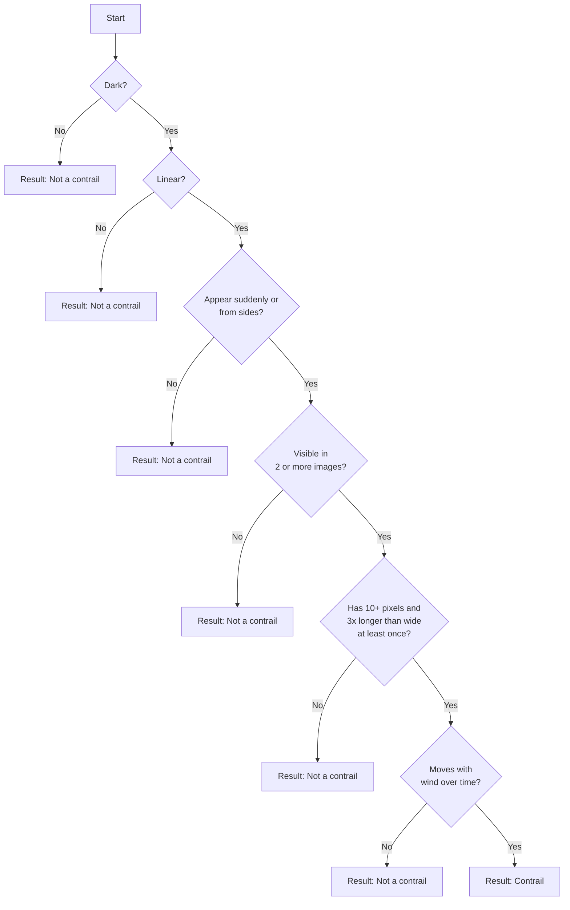

# GOES16-satellite-detection
Repository for machine learning-based contrail detection in GOES-16 satellite imagery to combat global warming

## Acknowledgements:
##### https://storage.googleapis.com/goes_contrails_dataset/20230419/Contrail_Detection_Dataset_Instruction.pdf
##### https://www.kaggle.com/competitions/google-research-identify-contrails-reduce-global-warming/data
##### high-score-example: https://www.kaggle.com/code/egortrushin/gr-icrgw-training-with-4-folds
##### visualize: https://www.kaggle.com/code/inversion/visualizing-contrails#OpenContrails-dataset-documentation