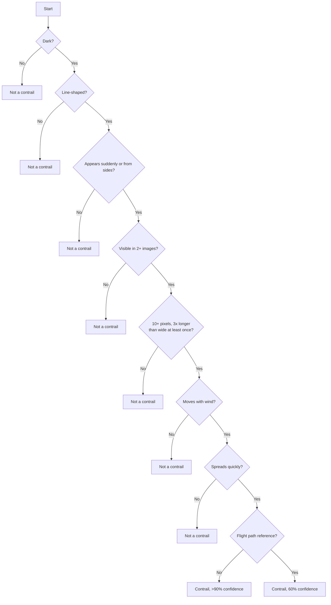
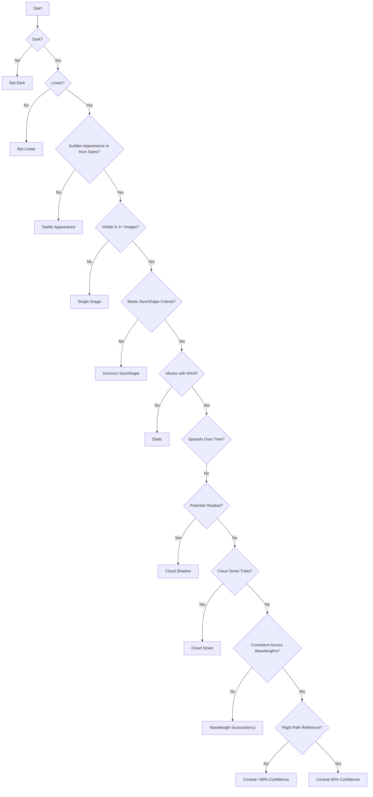

Title:
# GOES16 Contrail Detection with Computer Vision

Description:

Harnessing machine learning and computer vision techniques, this project discerns contrails within GOES-16 satellite data, thereby supplying critical knowledge for climate change studies and global warming countermeasures. It exemplifies the conversion of intricate satellite data into data-driven, impactful environmental solutions.

 Contrails are thermodynamically formed condensation trails.

 High-temperature, high-humidity exhaust from aircraft engines undergoes adiabatic cooling and condensation upon encountering colder, drier air at cruising altitudes.

 This adiabatic process forms visible ice-crystal trails.

 These trails can persist for hours or days, depending on atmospheric conditions.

 Contrails contribute to the greenhouse effect by trapping heat in the atmosphere.

 Contrails introduce uncertainty in climate models due to prediction and modeling difficulties.

 Detecting and tracking contrails is essential for understanding their climate change impact and devising mitigation strategies.

## process of identifying a contrail:

- Darkness of the object:  Contrails are calibrated to appear darker than their surroundings in the image.

- Linearity of the object:  Contrails are line-shaped clouds produced by aircraft engines.

- Object appearance:  Does the object appear suddenly or enter from the sides of the image? Contrails are formed by planes moving at high speeds, so they appear quickly in the image.

- Object visibility:  Is the object visible in at least two images? As contrails are created by moving airplanes, they should be visible across multiple frames.

- Size and shape of the object:  Does the object contain at least 10 pixels and has it been at least three times longer than its width at some point? This is a unique characteristic of contrails due to their shape and formation.

- Object movement:  Does the object move with time due to wind? Contrails, being high in the atmosphere, will be influenced by wind, causing them to move and change shape over time.

## further considerations increasing confidence in contrail identification:

- Contrail Aging and Dissipation:   Over time, contrails spread and dissipate, becoming more diffuse. This might be another feature to consider. If an object starts very sharp and becomes gradually wider over time, it is likely a contrail.

- Contrail Color:   Although contrails are dark in infrared images, their color can vary in other types of images depending on the position of the sun and the altitude of the aircraft. This could provide additional information for contrail detection.

- Flight Path Alignment:   If possible, aligning the observed contrails with known flight paths could greatly increase the confidence of contrail identification.

- Cloud Shadows:   These can sometimes look like contrails. Shadows will usually be aligned with the sun's position and may not exhibit the same behavior as contrails in a sequence of images.

- Cloud Streets:   These are rows of cumulus clouds that could potentially be mistaken for contrails. However, they are typically wider, not as straight as contrails, and don't have the sudden appearance and dissipation behavior of contrails.
 
- Jet Stream Impact:   Contrails are affected by high altitude winds. Observing the direction and speed of wind aloft can help distinguish contrails from other linear objects.

- Consistency Across Different Wavelengths:   If multi-spectral images are available, a consistent appearance across different wavelengths could further support the identification of a contrail. 

- The detection algorithm should also consider objects that behave similarly to contrails and use additional rules or machine learning techniques to differentiate them:
    > Cloud shadows and cloud streets can sometimes mimic contrails. Cloud shadows will usually be aligned with the sun's position and may not exhibit the same behavior as contrails in a sequence of images. 
    >
    > Cloud streets are rows of cumulus clouds that could potentially be mistaken for contrails. However, they are typically wider, not as straight as contrails, and don't have the sudden appearance and dissipation behavior of contrails.  

## updated decision tree:

## Acknowledgements:

arxiv: https://arxiv.org/abs/2304.02122

contrails-labeling-guide: https://storage.googleapis.com/goes_contrails_dataset/20230419/Contrail_Detection_Dataset_Instruction.pdf

challenge-guide: https://www.kaggle.com/competitions/google-research-identify-contrails-reduce-gobal-warming/data

high-score-example: https://www.kaggle.com/code/egortrushin/gr-icrgw-training-with-4-folds

visualize (input dataset 450.91 GB): https://www.kaggle.com/code/inversion/visualizing-contrails#OpenContrails-dataset-documentation

GOES-16 (Geostationary Operational Environmental Satellite, Launch Date: Nov. 19, 2016): https://eospso.nasa.gov/missions/geostationary-operational-environmental-satellite-16

contrails dataset sample (11.74 GB) train_df.csv, valid_df.csv: https://www.kaggle.com/datasets/shashwatraman/contrails-images-ash-color