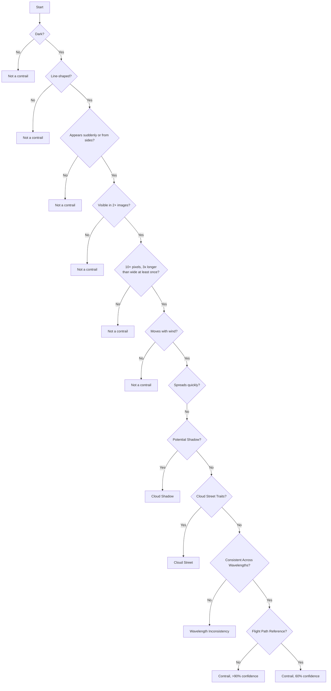

#### Title:
# GOES-16 Satellite Contrail Detection using CV/ML

### Optimizing satellite imagery, [GOES-R ABI](https://www.star.nesdis.noaa.gov/goes/index.php), and advanced computer vision/machine learning for accurate detection of contrails
### Atmospheric optics contrail shadows

---
### Process of identifying a contrail:

#### 1. Darkness of the object: Contrails appear darker than their surroundings in the image.
#### 2. Linearity of the object: Contrails are line-shaped clouds produced by aircraft engines.
#### 3. Object appearance: Contrails appear suddenly or enter from the sides of the image due to planes moving at high speeds.
#### 4. Object visibility: Contrails should be visible in at least two images, as they are created by moving airplanes.
#### 5. Size and shape of the object: Contrails have a length at least three times longer than their width and contain at least 10 pixels.
#### 6. Object movement: Contrails move and change shape over time due to wind influence.
#### 7. Contrail Aging and Dissipation: Contrails spread and become more diffuse over time.
#### 8. Contrail Color: Contrails' color can vary depending on the sun's position and aircraft altitude.
#### 9. Flight Path Alignment: Aligning observed contrails with known flight paths increases confidence in identification.
#### 10. Cloud Shadows: Shadows aligned with the sun's position may resemble contrails but behave differently in a sequence of images.
#### 11. Cloud Streets: Rows of cumulus clouds that are wider, less straight, and have different appearance and dissipation behavior than contrails.
#### 12. Jet Stream Impact: Contrails are influenced by high altitude winds, which can help distinguish them from other linear objects.
#### 13. Consistency Across Different Wavelengths: Consistent appearance across different wavelengths supports contrail identification.
#### 14. Consider similar objects: Cloud shadows and cloud streets can mimic contrails but exhibit different behaviors and characteristics.

---
### Reducing Contrail Formation: Strategies to Consider
##### Adjusting Altitudes: Change cruising altitude to avoid contrail-forming conditions, considering increased fuel use and CO2 emissions.
##### Optimizing Flight Paths: Modify routes to avoid areas with conditions conducive to contrail formation.
##### Modifying Flight Schedules: Adjust schedules to influence contrail climate effects during the day (cooling) and night (warming).
##### Enhancing Aircraft Efficiency: Improve efficiency to reduce exhaust water vapor and potentially decrease contrail occurrence.
##### Exploring Alternative Fuels: Investigate biofuels emitting less water vapor when burned to reduce contrails.
##### Utilizing Advanced Forecasts: Use weather prediction tech to identify high contrail formation areas and adjust flight paths.
---
### Acknowledgements:

#### 📌 arxiv: https://arxiv.org/abs/2304.02122
#### 📌 challenge-guide: https://www.kaggle.com/competitions/google-research-identify-contrails-reduce-global-warming
#### ☛ Adam Duran (Michigan Tech, Q&A with SATAVIA: Climate and Contrails): https://www.mtu.edu/unscripted/2021/06/qa-with-satavia-climate-and-contrails.html
#### ☛ contrails-labeling-guide: https://storage.googleapis.com/goes_contrails_dataset/20230419/Contrail_Detection_Dataset_Instruction.pdf
#### ☛ catalogues of atmospheric optics (rocket plume, contrail shadow): https://atoptics.co.uk/atoptics/shuttle.htm, https://atoptics.co.uk/atoptics/contr1.htm
#### ☛ high-score-example: https://www.kaggle.com/code/egortrushin/gr-icrgw-training-with-4-folds
#### ☛ visualize (input dataset 450.91 GB): https://www.kaggle.com/code/inversion/visualizing-contrails#OpenContrails-dataset-documentation
#### ☛ GOES-16 (Geostationary Operational Environmental Satellite, Launch Date: Nov. 19, 2016): https://eospso.nasa.gov/missions/geostationary-operational-environmental-satellite-16
#### ☛ contrails dataset sample (11.74 GB) train_df.csv, valid_df.csv: https://www.kaggle.com/datasets/shashwatraman/contrails-images-ash-color
