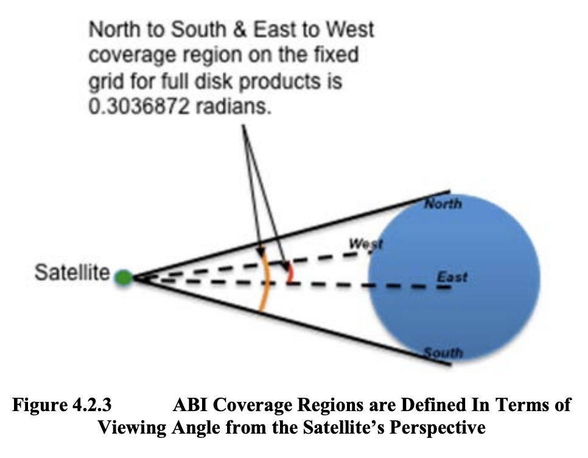
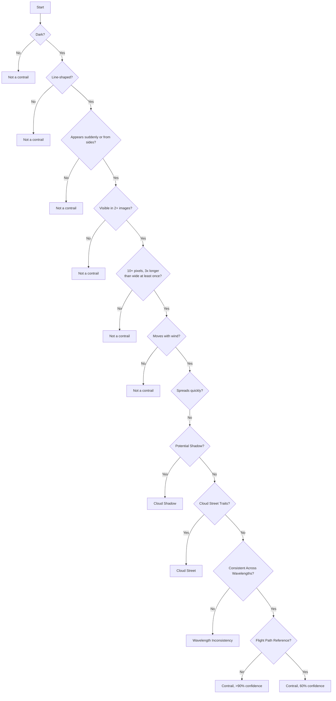

# Table of Contents
1. [GOES-16 Satellite Contrail Detection using CV/ML](#goes-16-satellite-contrail-detection-using-cvml)
    - [Atmospheric optics contrail shadows](#atmospheric-optics-contrail-shadows)
    - [Process of identifying a contrail](#process-of-identifying-a-contrail)
2. [Reducing Contrail Formation: Strategies to Consider](#reducing-contrail-formation-strategies-to-consider)
3. [Level 2+ Algorithm Products, page 43](#level-2-algorithm-products-page-43)
4. [Overview of the different bands used by the GOES-16 ABI, their wavelengths, types, and primary uses](#overview-of-the-different-bands-used-by-the-goes-16-abi-their-wavelengths-types-and-primary-uses)
5. [GOES-16 Baseline Products and RGBs](#goes-16-baseline-products-and-rgbs)
6. [GOES-16 Derived Products](#goes-16-derived-products)

#### Title:
# GOES-16 Satellite Contrail Detection using CV/ML

### Atmospheric optics contrail shadows

---
### Process of identifying a contrail:

##### 1. Darkness of the object: Contrails appear darker than their surroundings in the image.
##### 2. Linearity of the object: Contrails are line-shaped clouds produced by aircraft engines.
##### 3. Object appearance: Contrails appear suddenly or enter from the sides of the image due to planes moving at high speeds.
##### 4. Object visibility: Contrails should be visible in at least two images, as they are created by moving airplanes.
##### 5. Size and shape of the object: Contrails have a length at least three times longer than their width and contain at least 10 pixels.
##### 6. Object movement: Contrails move and change shape over time due to wind influence.
##### 7. Contrail Aging and Dissipation: Contrails spread and become more diffuse over time.
##### 8. Contrail Color: Contrails' color can vary depending on the sun's position and aircraft altitude.
##### 9. Flight Path Alignment: Aligning observed contrails with known flight paths increases confidence in identification.
##### 10. Cloud Shadows: Shadows aligned with the sun's position may resemble contrails but behave differently in a sequence of images.
##### 11. Cloud Streets: Rows of cumulus clouds that are wider, less straight, and have different appearance and dissipation behavior than contrails.
##### 12. Jet Stream Impact: Contrails are influenced by high altitude winds, which can help distinguish them from other linear objects.
##### 13. Consistency Across Different Wavelengths: Consistent appearance across different wavelengths supports contrail identification.
##### 14. Consider similar objects: Cloud shadows and cloud streets can mimic contrails but exhibit different behaviors and characteristics.

---
### Reducing Contrail Formation: Strategies to Consider
##### Adjusting Altitudes: Change cruising altitude to avoid contrail-forming conditions, considering increased fuel use and CO2 emissions.
##### Optimizing Flight Paths: Modify routes to avoid areas with conditions conducive to contrail formation.
##### Modifying Flight Schedules: Adjust schedules to influence contrail climate effects during the day (cooling) and night (warming).
##### Enhancing Aircraft Efficiency: Improve efficiency to reduce exhaust water vapor and potentially decrease contrail occurrence.
##### Exploring Alternative Fuels: Investigate biofuels emitting less water vapor when burned to reduce contrails.
##### Utilizing Advanced Forecasts: Use weather prediction tech to identify high contrail formation areas and adjust flight paths.
##### Developing Contrail Avoidance Tech: Create new tech to detect contrails and avoid them in real-time.
---
### [Level 2+ Algorithm Products, page 43](https://www.goes-r.gov/products/docs/PUG-L2+-vol5.pdf)

---
### Overview of the different bands used by the GOES-16 ABI, their wavelengths, types, and primary uses

| ABI Band # | Wavelength | Type | Primary Uses |
|---|---|---|---|
| 1 | 0.47 microns | Visible (“Blue Band”) | Monitoring aerosols (smoke, haze, dust), Air quality monitoring |
| 2 | 0.64 microns | Visible (“Red Band”) | Daytime monitoring of clouds, Volcanic ash monitoring |
| 3 | 0.86 microns | Near–IR (“Veggie Band”) | High contrast between water and land, Assess land characteristics including flooding impacts, burn scars, and hail swath damage |
| 4 | 1.37 microns | Near-IR (“Cirrus Band”) | Thin cirrus detection during the day, Volcanic ash monitoring |
| 5 | 1.6 microns | Near–IR (“Snow/Ice Band”) | Daytime snow, ice, and cloud discrimination |
| 6 | 2.24 microns | Near-IR (“Cloud Particle Size Band”) | Cloud particle size, snow, and cloud phase, Hot spot detection at emission temperatures of greater than 600K |
| 7 | 3.9 microns | IR (“Shortwave Window Band”) | Low stratus and fog, Fire/hot spot detection and volcanic ash |
| 8 | 6.2 microns | IR (“Upper Troposphere WV Band”) | Upper-level feature detection (jet stream, waves, etc.) |
| 9 | 6.9 microns | IR (“Mid-Level Troposphere WV Band”) | Mid-level feature detection |
| 10 | 7.3 microns | IR (“Low-Level Troposphere WV Band”) | Low-level feature detection (EML, fronts) |
| * 11 | 8.4 microns | IR (“Cloud-Top Phase Band”) | Cloud-top phase and type products, Volcanic ash (S02 detection) and dust |
| 12 | 9.6 microns | IR (“Ozone Band”) | Dynamics near the tropopause including stratospheric intrusions, Input to Airmass RGB |
| 13 | 10.3 microns | IR (“Clean IR Longwave Band”) | Less sensitive to atmospheric moisture than the other IR channels |
| * 14 | 11.2 microns | IR (“IR Longwave Band”) | Differenced with the 3.9 micron near IR channel for low stratus and fog detection |
| * 15 | 12.3 microns | IR (“Dirty IR Longwave Band”) | Greater sensitivity to moisture, Contributes to total PWAT and low-level moisture information |
| 16 | 13.3 microns | IR (“CO2 Longwave IR Band”) | Mean tropospheric air temperature estimation |

---
### GOES-16 Baseline Products and RGBs

| Product/RGB | Description | Availability/Frequency | ABI Bands Used | Special Features | Limitations |
|-------------|-------------|------------------------|----------------|------------------|-------------|
|* Derived-Motion Winds (DMWs) | Uses a set of three sequential images to estimate atmospheric motion using six ABI bands following a set of targets (cloud edges or clear sky water vapor gradients) | Full Disk: 60 minutes, CONUS: 15 minutes, Mesoscale: 5 minutes | Bands 2, 5, and 14 | Uses the ABI Cloud Height Algorithm (ACHA) to assign heights | - |
|Airmass RGB | Monitors stratospheric intrusions during cyclogenesis | - | - | Distinguishes between high-PV, ozone-rich stratospheric air (appearing red/orange) and other conditions | - |
|Daytime Convection RGB | Helps identify convection with strong updrafts and small ice particles indicative of severe storms | Daytime only | - | Useful for determining storm strength and the stage of development | Pixel color fades when the sun angle is low, false “Yellow/Strong Convection” may be caused by mountain wave, dust or cold cloud tops with only moderate 3.9-micron reflectance |
|Nighttime Microphysics RGB | Useful for fog and low-cloud analysis and differentiation | Nighttime only | - | Allows for quick cloud type discrimination, Outflow boundaries and drylines can be seen | Thin fog can blend with the surface, shortwave noise in extreme cold. Color of cloud-free regions varies based on temperature, moisture, and surface type |
|Fire Detection and Characterization (FDC) | Detects fires by looking for hot spots exploiting the 3.9-micron channel | - | 3.9-micron channel | Can estimate instantaneous fire size and temperature, calculates Fire Radiative Power (FRP) | Screens out surfaces that are not usable, such as water, tundra, deserts, and sparsely vegetated mountains. Also screens out clouds that are opaque for ~4-micron radiation |
|* Rainfall Rate Product | Provides an estimate of rainfall rate | Full Disk (Day and Night), Available every 15 minutes with less than 5-minute latency | ABI bands 8, 10, 11, 14, and 15 | Full ABI pixel resolution, 0 to 3.9 in/hr range | Does not account for orographic effects, sub-cloud evaporation, and sub-cloud phase changes |
|Geostationary Lightning Mapper | Provides lightning spatial extent, storm triage, and information on developing convection | 20-second updates | - | Differentiates between events, groups, and flashes | - |

### GOES-16 Derived Products
The methodology involved in creating this dataset is as follows:

1. **Image Collection**: The researchers collected images from the GOES-16 Advanced Baseline Imager (ABI) which provides high-resolution full-disk images.

2. **Labeling**: To create human-labeled contrail images, human labelers were given a map of brightness temperature difference (BTD) between two infrared channels of ABI. On this map, contrails appeared as lines of positive BTD values. The labelers were asked to draw lines in the middle of each contrail, creating a human-labeled image for each scene in the OpenContrails dataset.

3. **Contrail Detection Model**: The researchers developed a contrail detection model using a U-Net architecture, which takes multiple input frames for temporal context. The model output is a continuous-valued per-pixel output that can be thresholded to obtain binary contrail masks. The model is trained to minimize the mean square error between its output and the human labels for all of the input images.

4. **Model Training**: The researchers trained the model on the human-labeled images from the OpenContrails dataset. They achieved an area under the ROC curve (AUC) score of 0.63 on the test set.

5. **Model Evaluation**: The contrail detection model was evaluated by running it on multiple years of available GOES-16 images. The researchers confirmed previous findings on contrail research, such as contrail coverage patterns and diurnal effects.

6. **Model Output Availability**: The outputs of the contrail detection model are publicly available on Google Cloud Storage at gs://goes_contrails_dataset. This dataset and the contrail detection model can be used as a foundation for contrail warming impact assessment and validating contrail avoidance experiments in the western hemisphere.
