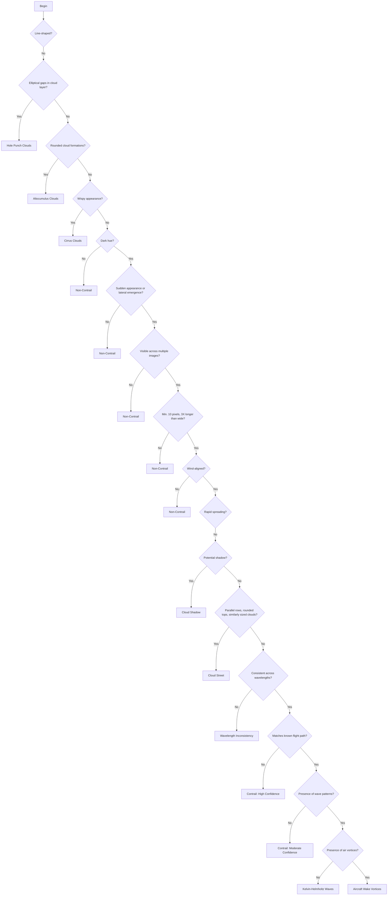

# Table of Contents

1. [CV/ML-Based Contrail Detection Using GOES-16 Satellite Data](#cvml-based-contrail-detection-using-goes-16-satellite-data)
   - [Sky Phenomena Misinterpreted as Contrails and Their Implications for Climate Change](#sky-phenomena-misinterpreted-as-contrails-and-their-implications-for-climate-change)
   - [Process of Contrail Identification](#process-of-contrail-identification)
   - [Key Characteristics for Contrail Identification](#key-characteristics-for-contrail-identification)
   - [Reducing Contrail Formation: Strategies to Consider](#reducing-contrail-formation-strategies-to-consider)
2. [Level 2+ Algorithm Products](#level-2-algorithm-products)
3. [Overview of the different bands used by the GOES-16 ABI, their wavelengths, types, and primary uses](#overview-of-the-different-bands-used-by-the-goes-16-abi-their-wavelengths-types-and-primary-uses)
4. [GOES-16 Baseline Products and RGBs](#goes-16-baseline-products-and-rgbs)
5. [GOES-16 Derived Products](#goes-16-derived-products)
6. [WG84 Ellipsoid](#wg84-ellipsoid)
7. [Advanced Methods for Medical Image Segmentation](#advanced-methods-for-medical-image-segmentation)
   - [Comparing the Performance of UNet++, UNeXt, and CE-Net](#comparing-the-performance-of-unet-unext-and-ce-net)
   - [UNet++: An Advanced Image Segmentation Network](#unet-an-advanced-image-segmentation-network)
   - [Comparison of Image Segmentation Models](#comparison-of-image-segmentation-models)
---

# Research notes: <br>CV/ML-Based Contrail Detection Using GOES-16 Satellite Data

## Sky Phenomena Misinterpreted as Contrails and Their Implications for Climate Change

1. **Cirrus Clouds**: These ice crystal formations at high altitudes are often confused for contrails. They trap Earth's outgoing heat, contributing to climate warming.
2. **Dissipation Trails (Distrails)**: Formed by aircraft in stratocumulus layers, these clear sky corridors can be mistaken as contrails. Distrails cool the climate by reducing solar radiation.
3. **Cloud Streets**: These linear arrangements of cumulus clouds are sometimes confused with contrails due to their paralalel alignment. Their climatic effect is twofold, reflecting sunlight into space while also trapping Earth's heat.
4. **Cloud Shadows**: These darker zones on lower cloud layers or Earth's surface can be misinterpreted as contrails. They cool the climate by reducing solar energy absorption.
5. **Fallstreak Holes (Hole Punch Clouds)**: Triggered by aircraft within cirrocumulus or altocumulus layers, these gaps can be mistaken for contrails. They warm the climate by increasing surface exposure to sunlight.
6. **Jet Stream Clouds**: These linear formations of ice crystals within high-altitude wind corridors can be mistaken as contrails. They trap heat, contributing to climate warming.
7. **Kelvin-Helmholtz Waves**: Despite their distinctive wave-like formations, these can be misclassified. Their climatic impact is negligible due to their infrequency and transient existence.
8. **Aircraft Wake Vortices**: These spiraling air streams from aircraft can resemble contrails. They indirectly impact the climate by altering cloud and precipitation properties and creating heat-trapping contrails.

Recognizing these sky phenomena, their climatic effects, and correctly distinguishing them from contrails are key to developing informed climate change strategies.


---

## Process of Contrail Identification:



---

## Key Characteristics for Contrail Identification
- **Darkness**: Contrails appear darker than surrounding clouds.
- **Linearity**: Contrails are line-shaped clouds emitted by aircraft engines.
- **Appearance**: Contrails appear suddenly or from the sides of the image, indicative of high-speed aircraft movement.
- **Visibility**: Contrails should be discernible in at least two images, reflecting the motion of the aircraft.
- **Size and Shape**: Contrails are typically at least three times longer than their width and occupy at least 10 pixels.
- **Movement and Dissipation**: Wind influence causes contrails to move and spread over time.
- **Color Variance**: The color of contrails can change depending on the sun's position and the aircraft's altitude.
- **Flight Path Alignment**: Matching observed contrails with known flight paths increases identification confidence.
- **Consistency across Wavelengths**: A consistent appearance across different wavelengths supports contrail identification.

## Strategies for Reducing Contrail Formation
- **Altitude Adjustment**: Modify cruising altitude to avoid contrail-forming conditions. This should balance with fuel use and CO2 emissions.
- **Flight Path Optimization**: Reroute aircraft to avoid regions with favorable conditions for contrail formation.
- **Flight Schedule Modification**: Change flight schedules to manage the day (cooling) and night (warming) climate effects of contrails.
- **Aircraft Efficiency**: Enhance aircraft efficiency to reduce exhaust water vapor and lower contrail formation.
- **Alternative Fuels**: Research into biofuels that emit less water vapor could help reduce contrail occurrences.
- **Advanced Forecasts**: Utilize weather forecasting technology to identify areas with high contrail formation potential and adjust flight paths accordingly.
- **Contrail Avoidance Tech**: Develop technology for real-time contrail detection and avoidance. 


---
### [Level 2+ Algorithm Products, page 43](https://www.goes-r.gov/products/docs/PUG-L2+-vol5.pdf)

---
### Overview of the different bands used by the GOES-16 ABI, their wavelengths, types, and primary uses

| ABI Band # | Wavelength | Type | Primary Uses |
|---|---|---|---|
| 1 | 0.47 microns | Visible (“Blue Band”) | Monitoring aerosols (smoke, haze, dust), Air quality monitoring |
| 2 | 0.64 microns | Visible (“Red Band”) | Daytime monitoring of clouds, Volcanic ash monitoring |
| 3 | 0.86 microns | Near–IR (“Veggie Band”) | High contrast between water and land, Assess land characteristics including flooding impacts, burn scars, and hail swath damage |
| 4 | 1.37 microns | Near-IR (“Cirrus Band”) | Thin cirrus detection during the day, Volcanic ash monitoring |
| 5 | 1.6 microns | Near–IR (“Snow/Ice Band”) | Daytime snow, ice, and cloud discrimination |
| 6 | 2.24 microns | Near-IR (“Cloud Particle Size Band”) | Cloud particle size, snow, and cloud phase, Hot spot detection at emission temperatures of greater than 600K |
| 7 | 3.9 microns | IR (“Shortwave Window Band”) | Low stratus and fog, Fire/hot spot detection and volcanic ash |
| 8 | 6.2 microns | IR (“Upper Troposphere WV Band”) | Upper-level feature detection (jet stream, waves, etc.) |
| 9 | 6.9 microns | IR (“Mid-Level Troposphere WV Band”) | Mid-level feature detection |
| 10 | 7.3 microns | IR (“Low-Level Troposphere WV Band”) | Low-level feature detection (EML, fronts) |
| * 11 | 8.4 microns | IR (“Cloud-Top Phase Band”) | Cloud-top phase and type products, Volcanic ash (S02 detection) and dust |
| 12 | 9.6 microns | IR (“Ozone Band”) | Dynamics near the tropopause including stratospheric intrusions, Input to Airmass RGB |
| 13 | 10.3 microns | IR (“Clean IR Longwave Band”) | Less sensitive to atmospheric moisture than the other IR channels |
| * 14 | 11.2 microns | IR (“IR Longwave Band”) | Differenced with the 3.9 micron near IR channel for low stratus and fog detection |
| * 15 | 12.3 microns | IR (“Dirty IR Longwave Band”) | Greater sensitivity to moisture, Contributes to total PWAT and low-level moisture information |
| 16 | 13.3 microns | IR (“CO2 Longwave IR Band”) | Mean tropospheric air temperature estimation |

---
### GOES-16 Baseline Products and RGBs

| Product/RGB | Description | Availability/Frequency | ABI Bands Used | Special Features | Limitations |
|-------------|-------------|------------------------|----------------|------------------|-------------|
|* Derived-Motion Winds (DMWs) | Uses a set of three sequential images to estimate atmospheric motion using six ABI bands following a set of targets (cloud edges or clear sky water vapor gradients) | Full Disk: 60 minutes, CONUS: 15 minutes, Mesoscale: 5 minutes | Bands 2, 5, and 14 | Uses the ABI Cloud Height Algorithm (ACHA) to assign heights | - |
|Airmass RGB | Monitors stratospheric intrusions during cyclogenesis | - | - | Distinguishes between high-PV, ozone-rich stratospheric air (appearing red/orange) and other conditions | - |
|Daytime Convection RGB | Helps identify convection with strong updrafts and small ice particles indicative of severe storms | Daytime only | - | Useful for determining storm strength and the stage of development | Pixel color fades when the sun angle is low, false “Yellow/Strong Convection” may be caused by mountain wave, dust or cold cloud tops with only moderate 3.9-micron reflectance |
|Nighttime Microphysics RGB | Useful for fog and low-cloud analysis and differentiation | Nighttime only | - | Allows for quick cloud type discrimination, Outflow boundaries and drylines can be seen | Thin fog can blend with the surface, shortwave noise in extreme cold. Color of cloud-free regions varies based on temperature, moisture, and surface type |
|Fire Detection and Characterization (FDC) | Detects fires by looking for hot spots exploiting the 3.9-micron channel | - | 3.9-micron channel | Can estimate instantaneous fire size and temperature, calculates Fire Radiative Power (FRP) | Screens out surfaces that are not usable, such as water, tundra, deserts, and sparsely vegetated mountains. Also screens out clouds that are opaque for ~4-micron radiation |
|* Rainfall Rate Product | Provides an estimate of rainfall rate | Full Disk (Day and Night), Available every 15 minutes with less than 5-minute latency | ABI bands 8, 10, 11, 14, and 15 | Full ABI pixel resolution, 0 to 3.9 in/hr range | Does not account for orographic effects, sub-cloud evaporation, and sub-cloud phase changes |
|Geostationary Lightning Mapper | Provides lightning spatial extent, storm triage, and information on developing convection | 20-second updates | - | Differentiates between events, groups, and flashes | - |


# Methodology for Creating the OpenContrails Dataset

The methodology involved in creating this dataset is as follows:

1. **Image Collection**: The researchers collected images from the GOES-16 Advanced Baseline Imager (ABI) which provides high-resolution full-disk images.

2. **Labeling**: To create human-labeled contrail images, human labelers were given a map of brightness temperature difference (BTD) between two infrared channels of ABI. On this map, contrails appeared as lines of positive BTD values. The labelers were asked to draw lines in the middle of each contrail, creating a human-labeled image for each scene in the OpenContrails dataset.

3. **Contrail Detection Model**: The researchers developed a contrail detection model using a U-Net architecture, which takes multiple input frames for temporal context. The model output is a continuous-valued per-pixel output that can be thresholded to obtain binary contrail masks. The model is trained to minimize the mean square error between its output and the human labels for all of the input images.

4. **Model Training**: The researchers trained the model on the human-labeled images from the OpenContrails dataset. They achieved an area under the ROC curve (AUC) score of 0.63 on the test set.

5. **Model Evaluation**: The contrail detection model was evaluated by running it on multiple years of available GOES-16 images. The researchers confirmed previous findings on contrail research, such as contrail coverage patterns and diurnal effects.

6. **Model Output Availability**: The outputs of the contrail detection model are publicly available on Google Cloud Storage at gs://goes_contrails_dataset. This dataset and the contrail detection model can be used as a foundation for contrail warming impact assessment and validating contrail avoidance experiments in the western hemisphere.

### WG84 Ellipsoid


The WGS84 Ellipsoid is a geodetic reference system that defines an Earth-centered, Earth-fixed (ECEF) coordinate system, a reference ellipsoid, and a geodetic datum. The vertical datum specifies the reference surface for orthometric heights, while the coordinate system provides the reference frame for geodetic latitude and longitude. The horizontal datum establishes the relationship between the reference ellipsoid and the geoid. The diagram in the image compares a sphere and an ellipsoid. An ellipsoid provides a more accurate representation of the Earth’s shape as it accounts for its oblateness, characterized by its semi-major and semi-minor axes and flattening.

```python
from pyproj import CRS, Transformer

# Define the WGS84 geographic coordinate system
wgs84 = CRS.from_epsg(4326)

# Define a projected coordinate system (e.g., UTM Zone 10N)
utm10n = CRS.from_epsg(32610)

# Create a transformer object to convert between the two coordinate systems
transformer = Transformer.from_crs(wgs84, utm10n)

# Transform a point from WGS84 to UTM Zone 10N
x, y = transformer.transform(45.5236, -122.6750)
print(f"UTM coordinates: {x:.3f}, {y:.3f}")
```
The code above defines the WGS84 geographic coordinate system using its EPSG code (4326) and creates a transformer object to convert between WGS84 and another projected coordinate system (in this case, UTM Zone 10N). The code then uses the transformer object to convert a point from WGS84 latitude and longitude coordinates to UTM coordinates.


### Advanced Methods for Medical Image Segmentation
#### Comparing the Performance of UNet++, UNeXt, and CE-Net

- **UNet++** is a nested U-Net architecture that has been shown to achieve an average IoU gain of 3.9 and 3.4 points over U-Net and wide U-Net, respectively .
- **UNeXt** is an MLP-based rapid medical image segmentation network that aims to be more efficient for point-of-care applications. It has been shown to reduce the number of parameters by 72x, decrease computational complexity by 68x, and improve inference speed by 10x while also obtaining better segmentation performance over state-of-the-art medical image segmentation architectures .
- Another method that outperforms the original U-Net is **CE-Net**, which is widely applied to 2D medical image segmentation .

#### UNet++: An Advanced Image Segmentation Network
- Based on U-Net architecture, a convolutional neural network designed for image segmentation.
- Introduces intermediate layers to skip connections.
- Forms multiple up-sampling paths from different depths.
- Uses densely connected nested decoder sub-networks.
- Reduces semantic gap between feature maps of encoder and decoder sub-networks.
- Uses deep supervision for accurate and fast modes.
- Outperforms U-Net in several medical image segmentation tasks.

### Comparison of Image Segmentation Models
Quick overview of UNet++, CE-Net, SA-Net, UNeXt, U-Net, MSU-NET, High Resolution Network, and ResNet

| Model | Key Feature | Pros | Cons |
|-------|-------------|------|------|
| UNet++ | Densely connected nested decoder sub-networks and deep supervision | Reduces the semantic gap between the feature maps of the encoder and decoder sub-networks | More complex architecture |
| CE-Net | Context encoder network with a feature encoder module, a context extractor, and a feature decoder module | Captures more high-level information and preserves spatial information | More complex architecture |
| SA-Net | Scale-attention mechanism | Improves performance on small objects and fine-grained details | More complex architecture |
| UNeXt | MLP-based rapid medical image segmentation network | More efficient for point-of-care applications | May not perform as well on more complex segmentation tasks |
| U-Net | Contracting path and expansive path with skip connections | Effective at learning from small datasets | May lose some spatial information due to consecutive pooling and strided convolutional operations |
| MSU-NET | Multi-scale U-net architecture | Captures features at multiple scales | More complex architecture |
| High Resolution Network | High-resolution representations through the whole process | Maintains high-resolution representations through the whole process, improving performance on fine-grained details | More complex architecture |
| ResNet | Residual connections that allow gradients to flow directly through the network | Improves training of very deep networks by allowing gradients to flow directly through the network | May not perform as well on more complex segmentation tasks |

Please note that this table provides a general overview of some key features, pros, and cons of these models. The specific pros and cons may vary depending on the specific task and dataset.

References:

1. [UNet++: A Nested U-Net Architecture for Medical Image Segmentation](https://arxiv.org/abs/1807.10165) (2018)
2. [CE-Net: Context Encoder Network for 2D Medical Image Segmentation](https://arxiv.org/pdf/1903.02740.pdf) (2019)
3. [SA-Net: A scale-attention network for medical image segmentation](https://journals.plos.org/plosone/article?id=10.1371/journal.pone.0247388) (2021)
4. [UNeXt: MLP-based Rapid Medical Image Segmentation Network](https://arxiv.org/abs/2203.04967) (2022)
5. [UNet++ Explained | Papers With Code](https://paperswithcode.com/method/unet)
6. [UNet++ Clearly Explained — A Better Image Segmentation Architecture](https://pub.towardsai.net/unet-clearly-explained-a-better-image-segmentation-architecture-f48661c92df9)
7. [UNet++: A Nested U-Net Architecture for Medical Image Segmentation](https://github.com/MrGiovanni/UNetPlusPlus)
8. [U-Net-Based Medical Image Segmentation](https://www.hindawi.com/journals/jhe/2022/4189781/)
9. [MSU-NET: Multi-Scale U-net for 2D Medical Image Segmentation](https://www.frontiersin.org/articles/10.3389/fgene.2021.639930/full)
10. [U-Net: Image Segmentation Network](https://neurohive.io/en/popular-networks/u-net/)
11. [High Resolution Networks for Visual Recognition](https://link.springer.com/chapter/10.1007/978-3-031-16443-9_3)
12. [High Resolution Network: A Universal Neural Architecture for Visual Recognition](https://www.microsoft.com/en-us/research/blog/high-resolution-network-a-universal-neural-architecture-for-visual-recognition/)
13. [Understanding ResNet, AlexNet, VGG, Inception](https://cv-tricks.com/cnn/understand-resnet-alexnet-vgg-inception/)
14. [Residual Networks (ResNet) – Deep Learning](https://www.geeksforgeeks.org/residual-networks-resnet-deep-learning/)


### Evaluating Segmentation Performance

- Metrics include accuracy, IoU, Dice coefficient, sensitivity, specificity, and precision.
- IoU measures overlap between predicted and ground truth segmentation.
- Binary segmentation: one IoU value; multi-class segmentation: IoU calculated for each class separately, then averaged.
- Dice coefficient measures overlap between predicted and ground truth segmentation as twice the size of their intersection divided by the sum of their sizes.
- Dice coefficient gives more weight to true positives, while IoU gives equal weight to true positives, false positives, and false negatives.

### Downcasting Data Types to Reduce Memory Usage - Time Series Data

